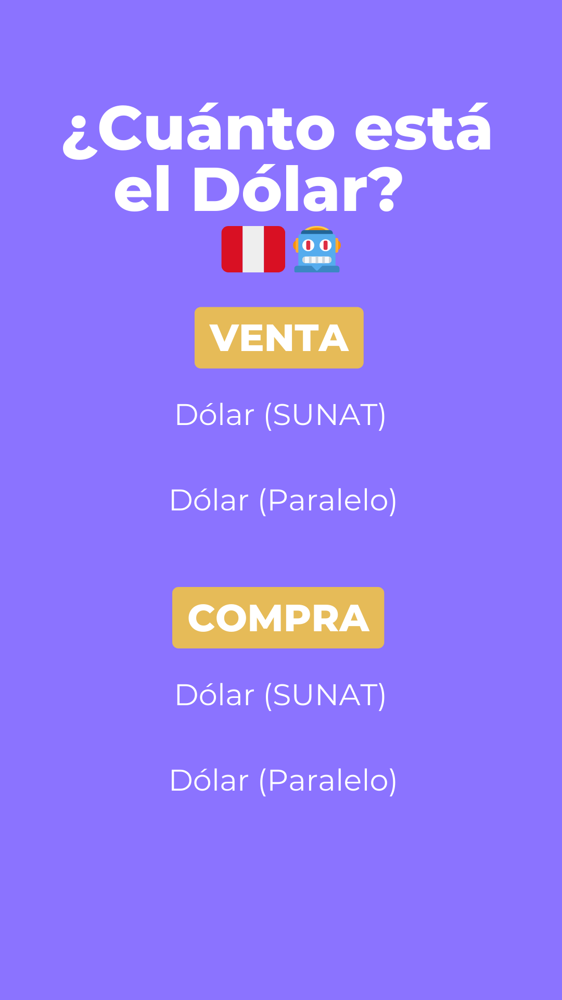
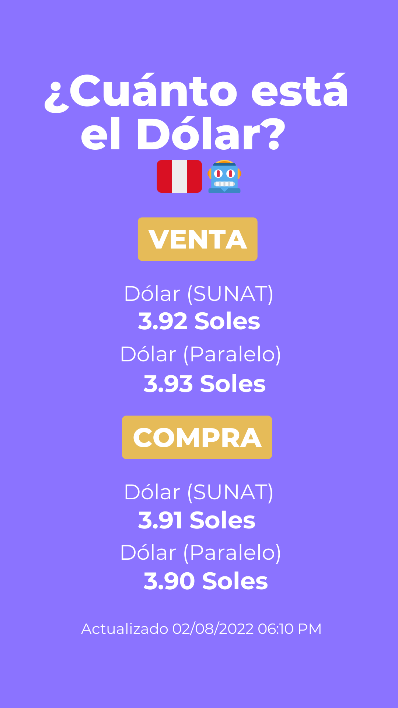

# Instagram Bot 🤖 / Cuánto Está el Dólar Perú (How Much Is The Dollar in Peru) 🇺🇸🇵🇪

💰 A script made with python that gets the current US dollar price (for buy and sell) in comparisson to the peruvian currency and upload it to an Instagram account's story.  
🤖 Utilizes web scraping techniques to extract real-time exchange rate data from trusted sources and also to manipulate the Instagram Web App. 
🔥 Was tested on an Instagram Account on Summer 2022 <a href="https://www.instagram.com/cuantoestaeldolarpe/">@cuantoestaeldolarpe</a>.

## Base Image with Instagram Story Size

## Image edited with the PIL library for python with the buy and sell dollar data

